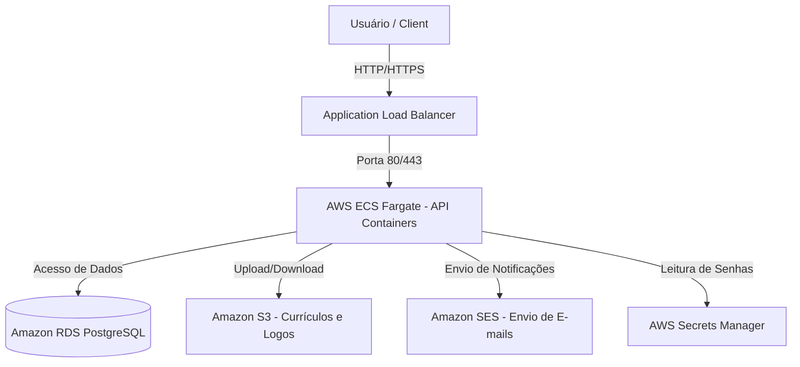

# ☁️ Arquitetura AWS e Planejamento de Integrações

Este documento descreve o ecossistema e os serviços da **Amazon Web Services (AWS)** planejados para hospedar e integrar o backend do **Aliança Psicossocial**. Ele serve como guia para a infraestrutura como código (IaC) e integrações na API.

---

## 📌 Sumário

1. [Visão Geral da Arquitetura](#1-visão-geral-da-arquitetura)
2. [Serviços AWS Planejados](#2-serviços-aws-planejados)
3. [Guia de Configuração e Variáveis](#3-guia-de-configuração-e-variáveis)
4. [Lista de Afazeres (To-Do List) AWS](#4-lista-de-afazeres-to-do-list-aws)

---

## 1. Visão Geral da Arquitetura

O sistema é desenhado seguindo práticas modernas de cloud-native, garantindo alta disponibilidade, segurança e escalabilidade automática:



---

## 2. Serviços AWS Planejados

### 🗃️ 1. Amazon S3 (Simple Storage Service)
* **Objetivo:** Armazenamento de arquivos estáticos de forma segura e durável.
* **Uso no Projeto:**
  * Armazenar currículos dos candidatos em formato PDF/DOCX.
  * Armazenar logos corporativos das empresas contratantes e imagens de perfil dos candidatos.
* **Segurança:** Buckets privados. Acesso de leitura aos currículos feito temporariamente via **Presigned URLs** com tempo de expiração curto (ex: 15 minutos), impedindo acesso público direto a dados sensíveis (LGPD).

### 📧 2. Amazon SES (Simple Email Service)
* **Objetivo:** Serviço de envio de e-mails em massa e transacionais de alta confiabilidade.
* **Uso no Projeto:**
  * Enviar e-mails de confirmação de cadastro e recuperação de senha.
  * Notificações de mudança de status da candidatura (ex: "Seu currículo foi selecionado para entrevista!").
  * Alertas de novas vagas condizentes com o perfil do candidato.

### 💾 3. Amazon RDS (Relational Database Service) - PostgreSQL
* **Objetivo:** Banco de dados relacional totalmente gerenciado pela AWS.
* **Uso no Projeto:**
  * Armazenamento principal de tabelas do sistema (`usuarios`, `perfis`, `vagas`, `candidaturas`).
  * Configurado em Multi-AZ em ambiente de produção para alta disponibilidade (failover automático).
  * Backups automáticos diários com retenção configurável.

### 🐳 4. AWS ECS (Elastic Container Service) com AWS Fargate
* **Objetivo:** Orquestração de containers Docker de forma Serverless.
* **Uso no Projeto:**
  * Executar a imagem Docker gerada pelo `Dockerfile` do backend de forma escalável e sob demanda.
  * O Fargate elimina a necessidade de gerenciar e atualizar servidores EC2 físicos.
  * Integração com **Auto Scaling** baseado em consumo de CPU/Memória para escalar o número de containers dinamicamente.

### 🔑 5. AWS Secrets Manager
* **Objetivo:** Armazenamento centralizado e rotação segura de credenciais.
* **Uso no Projeto:**
  * Guardar a senha de produção do banco RDS, segredos do JWT e chaves de APIs externas.
  * A aplicação Spring Boot lê os segredos em tempo de inicialização direto do Secrets Manager, evitando chaves expostas em arquivos de configuração locais.

---

## 3. Guia de Configuração e Variáveis

Para a comunicação da API Java com a AWS, utilizaremos o SDK oficial do **AWS SDK para Java v2** (`software.amazon.awssdk`). 

### Variáveis de Ambiente Necessárias (para `.env.prod` / `.env.homolog`)
```env
# AWS SDK - Credenciais e Região
AWS_REGION=sa-east-1
AWS_ACCESS_KEY_ID=sua_chave_de_acesso
AWS_SECRET_ACCESS_KEY=sua_chave_secreta

# S3 Configs
AWS_S3_BUCKET_NAME=aliancap-uploads-bucket

# SES Configs
AWS_SES_FROM_EMAIL=contato@aliancapsicossocial.com.br
```

> [!NOTE]
> Quando rodando dentro do AWS ECS Fargate em produção, **NÃO** configuramos `AWS_ACCESS_KEY_ID` e `AWS_SECRET_ACCESS_KEY`. Em vez disso, associamos uma **Task Role (IAM)** ao container, permitindo que a API obtenha credenciais temporárias automaticamente de forma muito mais segura.

---

## 4. Lista de Afazeres (To-Do List) AWS

Abaixo está o cronograma de implementação das integrações com a nuvem:

* [x] **Etapa 1: Configuração do SDK no Maven (`pom.xml`)**
  * Adicionar o BOM (`dependencyManagement`) do AWS Java SDK v2.
  * Adicionar dependências para `s3` e `ses`.
* [x] **Etapa 2: Integração com Amazon S3**
  * Criar classe de serviço `S3StorageService` implementando métodos `uploadFile`, `deleteFile` e `generatePresignedUrl`.
  * Configurar credenciais locais (`AwsBasicCredentials`) e em nuvem (`DefaultCredentialsProvider`).
* [x] **Etapa 3: Integração com Amazon SES**
  * Criar serviço de envio de e-mails `AwsEmailService` usando o cliente do SES.
  * Integrar o envio de e-mails assincronamente com `@Async` do Spring.
* [ ] **Etapa 4: Configuração da Infraestrutura (Terraform / CloudFormation)**
  * Criar scripts para provisionamento do banco RDS PostgreSQL.
  * Provisionar buckets S3 com regras de CORS e ciclo de vida.
  * Criar cluster ECS, Task Definitions e ALB para deploy da API.
